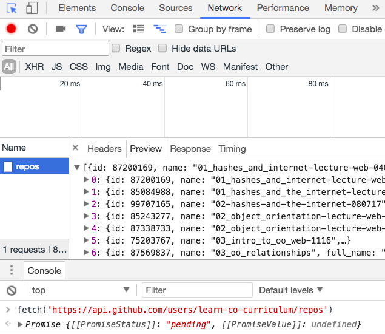
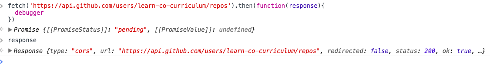

JavaScript Fetch
---

## Objectives

1. Explain how JavaScript fetches data from remote resources
2. Explain to make use of the promises built into fetch

## Introduction

We ended the previous section with the following code.

```js
document.addEventListener("DOMContentLoaded", function() {
  let link = document.querySelector('a')
  link.addEventListener('click', function(){
    getRepositories()
  })
});

function getRepositories() {
  const req = new XMLHttpRequest()
  req.addEventListener("load", showRepositories);
  req.open("GET", 'https://api.github.com/users/learn-co-curriculum/repos')
  req.send()
}

function showRepositories(event, data) {
  const repos = JSON.parse(this.responseText)
  const repoLis = repos.map(repo => `<li> ${repo.name} </li>`).join('')
  const repoList = `<ul> ${repoLis} </ul>`
  document.getElementById("repositories").innerHTML = repoList
}
```

The code works fine, however it is a little cumbersome.  First, we would like to be able to make the request to the Github api, and retrieve the data yet separate out what we would do with the data.  So we have a problem with the `getRepositories` function being tied to the `showRepositories` method.  Second, when have ever thought of making a request as both opening the request and sending that request - JavaScript's XMLHttpRequest interface feels very detailed. 

It would be nice if we had a method that uses promises to decouple the code.  Promises also make sense here, because we need to wait until our computer receives a response with data before handling this data.  It would also be nice if we had a method that were more abstract than the XMLHttpRequest interface.

### Introducing Fetch

The `fetch` method is built into JavaScript and allows us to make a request rather simply.  Open up the `index.html` file and paste the following code into Chrome's Javascript console.  

```js
  myRequest = fetch('https://api.github.com/users/learn-co-curriculum/repos')
  // Promise {[[PromiseStatus]]: "pending", [[PromiseValue]]: undefined}
  myRequest
  // Promise {[[PromiseStatus]]: "resolved", [[PromiseValue]]: Response}
```

Did you see that?  Calling `fetch('https://api.github.com/users/learn-co-curriculum/repos')` returned a promise.  The promise starts off as "pending" and then it turned to resolved.  So it seems like that one line of code made a request, and that it returned a promise that "resolved" when the promise received a response.  We can confirm this by going to the Network panel.

Upon clicking on Network in your developer tools, you will see that there is a request listed with the name "repos".  If you click on "repos", and then move to the "Headers" tab, you will see under "Request URL" that a request was made to  `https://api.github.com/users/learn-co-curriculum/repos`.  If you click on the "Response" tab, you will see that our computer has already received the data from github's api. 



### Working with the data

Ok, so now how do we work with that data in our Javascript code.  Well, remember `fetch` returns a promise.  So the way to handle data with `fetch` is to a large part the way to act on data with promises.  Let's do a super fast review.     

> Lightning Fast Promises Review
>
  As you know, `fetch` returns a JavaScript promise.  Here is the code from our earlier promises lesson.

  ```js
  const promise = new Promise(function(resolve) {
    setTimeout(function(){
      message = 'updated'
      resolve(message)
    }, 1000)
    }).then(function(messageArg){
      console.log(messageArg)
    })
  ```
  > As you can see, we initialize a promise and then resolve the promise passing it the "resolve" function to the then block.  That's the main point: the argument to the `then` method is how we resolve the promise.  That is the code that will wait until a promise is resolved.  

Ok, back to the show.  To make use of data from the `fetch` method in JavaScript, we do the following.  Here's the whole kitten-kaboodle.

```js

  fetch('https://api.github.com/users/learn-co-curriculum/repos').then(function(response){
    return response.json()
  }).then(function(json){
    let names = json.map(function(repo){ return `<li> ${repo.name} </li>` }).join(' ')
    document.querySelector('.repo-container').innerHTML = `<ul> ${names} </ul>`
  })
```

So we call `fetch`, pass it an argument of the url we request data from.  The first `.then` is passed a callback function which receives an argument of a response, and that response object has a method called JSON which itself returns a promise.  Finally, when the `response.json()` promise is resolved, we decide what to do with the response.  In this case, we append the response to the page.

### Two fetches, but why?

We admit that it is a little odd that when calling `fetch` we have to call `.then` twice to finally retrieve our data.  Let's dig into why.  Place a debugger inside of the first callback to `then`.     

```js
fetch('https://api.github.com/users/learn-co-curriculum/repos').then(function(response){
  debugger
})
```

Then type in the word `response` when your debugger is hit.  As you can see, our first resolve function is passed a JavaScript response object.  The object has attributes to indicate some information about the response - the status text, whether there was a redirect.  




Now type in `response.json()`.

```js
  response.json()
  // Promise {[[PromiseStatus]]: "pending", [[PromiseValue]]: undefined}
```

Here, you can see that `response.json()` itself returns a promise.  And that the promise is pending.  Now when the `response.json()` promise resolves, we would like to do something with the data.  So that is why we need another `then` method, it's because we need to wait for the promise returned from `response.json()` to resolve, and then we can do something with the data.

### Chaining Promises

One thing to note is that whenever we execute `.then()`, `then()` will return a JavaScript promise object.  This means that we can call `.then` on `.then`.  This is known as chaining a promise.  

```
let request = fetch('https://api.github.com/users/learn-co-curriculum/repos').then(function(response){
	return response.json()
}).then((response) => {
	console.log(response[0].name)
})
```

So in the above code, we called `fetch` to make the request, then in the first `.then` we received the response object as an argument to the resolve function.  Then in the second `.then` the resolve function received `response.json()` as its argument.  Note that we set this whole chain of methods equal to a variable called `request`.  Can you guess what `request` is equal to?

```js
	request 
   // Promise {[[PromiseStatus]]: "resolved", [[PromiseValue]]: undefined}
```  

It's equal to a promise, because `request` `.then()` always returns a promise.

Now, when chaining promises, we call `.then()` and then as an argument to `.then()` we pass our resolve function.  The resolve function is passed an argument - what determines that argument's value?  Well it is the return value of the previous resolve function.  Let's see an example of this.

```js

let request = fetch('https://api.github.com/users/learn-co-curriculum/repos').then(function(response){
	return response.json()
}).then((response) => {
	return 'blah'
}).then((response) => {
	console.log(response)
})
	
```
So if you place in the above code, you will see that "blah" is logged to the console.  This is because the previous resolve function returned the string "blah".

### Summary

As you can see, `fetch` provides us with a low-maintenance way to fetch and work with resources. With `fetch`, we simply pass in the url that we are requesting data from as a string.  The `fetch` method returns to us a promise, which is resolved when a response is received.  That promise is resolved with a response object.  The response object has a method on it called `json()` which itself returns a promise.  When that promise is resolved, we can do something with our data.

## Resources

- [MDN: Fetch](https://developers.google.com/web/updates/2015/03/introduction-to-fetch?hl=en)
